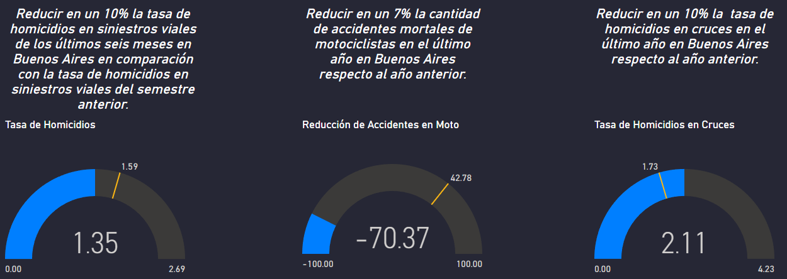

# Siniestros Viales en la ciudad de Buenos Aires, Argentina.

## Introducción

En este proyecto, se simula el papel de un Analista de Datos dentro del equipo de analistas de una empresa consultora. El Observatorio de Movilidad y Seguridad Vial (OMSV), un centro de estudios vinculado a la Secretaría de Transporte del Gobierno de la Ciudad Autónoma de Buenos Aires (CABA), ha solicitado la creación de un proyecto de análisis de datos.

El objetivo principal de este proyecto es generar información que permita a las autoridades locales tomar medidas para reducir la cantidad de víctimas fatales en los accidentes de tráfico ocurridos en CABA. Para lograrlo, se proporciona un conjunto de datos sobre homicidios en accidentes de tráfico ocurridos en la Ciudad de Buenos Aires durante el período 2016-2021.

Los productos finales esperados son un informe detallado que abarque las tareas realizadas, las metodologías adoptadas y las principales conclusiones, así como la presentación de un panel interactivo que facilite la interpretación de la información y su análisis.

## Contexto

Los siniestros viales, también conocidos como accidentes de tráfico o accidentes de tránsito, son eventos que involucran vehículos en las vías públicas y pueden originarse por diversas causas, como colisiones entre automóviles, motocicletas, bicicletas o peatones, atropellos, choques con objetos fijos o caídas de vehículos. Estos incidentes pueden tener consecuencias que van desde daños materiales hasta lesiones graves o fatales para los involucrados.

La Ciudad Autónoma de Buenos Aires, situada en la provincia de Buenos Aires, Argentina, no escapa a esta problemática. Los siniestros viales representan una preocupación importante debido al elevado volumen de tráfico y la densidad poblacional en la zona. Estos incidentes pueden afectar significativamente la seguridad de los residentes y visitantes, así como la infraestructura vial y los servicios de emergencia.

Según el censo poblacional de 2022, la población de CABA es de 3,120,612 habitantes en una superficie de 200 km², lo que resulta en una densidad de aproximadamente 15,150 personas por km² ([Fuente](https://www.indec.gob.ar/ftp/cuadros/poblacion/censo2022_indicadores_demograficos.pdf)). En este contexto, la prevención de siniestros viales y la implementación de políticas efectivas se vuelven esenciales para abordar adecuadamente este problema.

## Datos

Para este proyecto se trabajó con la **Bases de Víctimas Fatales en Siniestros Viales** que se encuentra en formato de Excel y contiene dos pestañas de datos:

* **HECHOS**: que contiene una fila de hecho con id único y las variables temporales, espaciales y participantes asociadas al mismo.
* **VICTIMAS**: contiene una fila por cada víctima de los hechos y las variables edad, sexo y modo de desplazamiento asociadas a cada víctima. Se vincula a los HECHOS mediante el id del hecho.

En este [documento](datos/Diccionario_Homicidios.pdf) se detallan todas las definiciones manejadas en los datos y en el desarrollo de este proyecto. Por otra parte, en este [link](https://data.buenosaires.gob.ar/dataset/victimas-siniestros-viales) se encuentran los datos utilizados en el análisis.

## Tecnologías utilizadas

Para la elaboración de este proyecto se utilizó Python y Pandas para los procesos de extracción, transformación y carga de los datos, como así también Seaborn y Matplot para el análisis exploratorio de los datos.

Luego, para la obtención complementaria de datos para el cálculo de la población en el año 2022 se realizó webscraping utilizando las herramientasn de Power BI.

Finalmente, para la construcción de un [dashboard](PI2_DA_Siniestros.pbix) interactivo se utiliza Power BI.

## ETL y EDA

En principio, se llevó a cabo un proceso de Extracción, Transformación y Carga (ETL) de datos tanto para la categoría de "HECHOS" como para "VÍCTIMAS". Durante este proceso, se normalizaron los nombres de las variables, se analizaron los registros en busca de valores nulos y duplicados, y se eliminaron columnas redundantes o con un alto índice de valores faltantes, entre otras tareas. Una vez completado este procedimiento para ambos conjuntos de datos de "Homicidios", se procedió a fusionar ambas colecciones en un único conjunto denominado homicidios_merge.

En una segunda parte, se llevó a cabo un exhaustivo Análisis Exploratorio de Datos (EDA) con el objetivo de identificar patrones que pudieran proporcionar información útil para que las autoridades locales adoptaran medidas destinadas a reducir la cantidad de víctimas mortales en incidentes viales. Todos los detalles de este análisis están documentados en [EDA_PT1 (ETL)](Notebooks/EDA_PT1.ipynb) y [EDA_PT2 (EDA)](Notebooks/EDA_PT2.ipynb).

## Análisis de los Datos

Primero se examinó la variable temporal para comprender la distribución de homicidios en diferentes escalas temporales. La distribución anual de víctimas fatales muestra alrededor del 60% para los primeros tres años del conjunto de datos, con una marcada disminución en 2020 debido a la cuarentena por COVID-19. Aunque la variación mensual es pronunciada, con un pico en diciembre, esta tendencia no es consistente a lo largo de los años, y se atribuye a la flexibilización de las medidas de cuarentena.

En una escala temporal más detallada, el 70% de las víctimas fatales ocurrieron de lunes a viernes, sugiriendo un posible vínculo con los desplazamientos diarios al trabajo. Sin embargo, la distribución semanal no muestra diferencias significativas entre los días, ya que la cantidad de víctimas en sábados y domingos es aproximadamente la misma.

Al analizar las franjas horarias, el 12% de las víctimas se registraron entre las 6 y 8 de la mañana, indicando posiblemente el horario de ingreso al trabajo.

El siguiente paso fue analizar el perfil de la víctima, revelando que el 77% son hombres y casi el 50% tienen entre 25 y 35 años, siendo el 84% de ellos masculinos. El 48% de las víctimas eran conductores, distribuidos en un 77% en moto y 19% en auto. Entre los conductores de moto, el 88% son hombres.

Al examinar la responsabilidad en el hecho, el 29% de los casos involucran autos, pero el 75% son responsabilidad de vehículos como autos, colectivos y camiones.

Finalmente, se encontró que Las víctimas de mayor edad tienden a estar más concentradas cuando son pasajeros, mientras que las víctimas más jóvenes son más frecuentes en las categorías de motocicletas y otros vehículos. Este patrón puede proporcionar información valiosa sobre las diferencias en la distribución de edades en distintas situaciones de accidentes, ayudando a identificar áreas de mayor riesgo y posibles medidas preventivas.

## KPI

Con base en la revisión anterior, se han formulado tres objetivos destinados a reducir el número de víctimas fatales en incidentes viales. A partir de estos objetivos, se presentan tres indicadores clave de rendimiento (KPI) sugeridos.

* *Reducir en un 10% la tasa de homicidios en siniestros viales de los últimos seis meses, en CABA, en comparación con la tasa de homicidios en siniestros viales del semestre anterior*

    Las tasas de mortalidad vinculadas a incidentes viales suelen constituir un indicador crucial de la seguridad vial en una determinada área. La Tasa de Homicidios en Incidentes Viales se define como el número de víctimas mortales en accidentes de tránsito por cada 100,000 habitantes en una región geográfica durante un periodo específico, en este caso, se consideran 6 meses. Su fórmula es:

    $\text{Tasa de homicidios en siniestros viales} = \frac{\text{Número de homicidios en siniestros viales}}{\text{Población total}}·100,000$

    Como *Población Total* se calculó la población para el año 2022 a partir de los censos poblacionales del año 2010 y 2022.

    En el primer semestre del año 2021, la *Tasa de Homicidios en Incidentes Viales* fue de **1.76**, indicando que durante los primeros 6 meses del año hubo aproximadamente **1.76** homicidios en accidentes de tránsito por cada 100,000 habitantes. El objetivo establecido es reducir esta tasa para el siguiente semestre de 2021 en un 10%, alcanzando así la cifra de **1.59**. Al calcular el KPI para este periodo, se obtiene que la *Tasa de Homicidios en Incidentes Viales* fue de **1.35**, lo que significa que se logró cumplir con éxito el objetivo propuesto para el segundo semestre de 2021.

* *Reducir en un 7% la cantidad de accidentes mortales de motociclistas en el último año, en CABA, respecto al año anterior*

    Como se evidenció en el análisis exploratorio, el 42% de las víctimas mortales se desplazaban en moto en el momento del incidente. Por lo tanto, se consideró crucial proponer la monitorización de la cantidad de accidentes mortales que involucran a este tipo de conductores. Para ello, se define la **Cantidad de Accidentes Mortales de Motociclistas** como el número absoluto de accidentes fatales en los cuales estuvieron involucradas víctimas que se desplazaban en moto durante un periodo temporal específico. La fórmula para evaluar la evolución de los accidentes mortales con víctimas en moto es la siguiente:

    $\text{Cantidad de accidentes mortales de motociclistas} = -\frac{\text{Víctimas moto año anterior - Víctimas moto año actual}}{\text{Víctimas moto año anterior}}·100$

    Donde:
    - $\text{Víctimas moto año anterior}$: Número de accidentes mortales con víctimas en moto en el año anterior
    - $\text{Víctimas moto año actual}$: Número de accidentes mortales con víctimas en moto en el año actual 

    En este contexto, considerando el año 2021 como el año actual y el año 2020 como el año anterior, se inició calculando la *Cantidad de Accidentes Mortales de Motociclistas* para el año 2020, obteniendo un valor de **46.00**. Por lo tanto, el objetivo a cumplir se fijó en **42.78** (equivalente a una reducción del 7% en comparación con la cantidad de accidentes para 2020).
    Al calcular la Cantidad de Accidentes Mortales de Motociclistas para el año 2021, se obtuvo un valor de **-70.37**, indicando un aumento del 70.37% en la cantidad de muertes de conductores de motocicletas en comparación con el año 2020. Este resultado sugiere un incumplimiento del objetivo propuesto, y podría señalar la necesidad de implementar estrategias adicionales para mejorar la seguridad de los motociclistas en el tránsito.

* *Reducir en un 10% la tasa de homicidios en los cruces en el último año, en CABA, respecto al año anterior*

    Como se vio en el análisis exploratorio, el 75.43% de las víctimas mortales transitaban por cruces al momento del hecho. Se define a la **Tasa de homicidios en Cruces** al número de víctimas fatales en accidentes de tránsito en avenidas por cada 100,000 habitantes en un área geográfica durante un período de tiempo específico, en este caso anual. Su fórmula es:

    $\text{Tasa de homicidios en cruces} = \frac{\text{Número de accidentes mortales con víctimas ocurridas en cruces}}{\text{Total de la población}}·100000$

    En primer lugar se calculó la *Tasa de homicidios en cruces* para el año 2020, la cual resultó en **1.92**. De esta se pudo determinar el objetivo a cumplir al año siguiente, que resultó en **1.73** (es decir, la reducción del 10% de la tasa de homicios respecto del 2020). Finalmente, al calcular la *Tasa de homicidios en cruces* para el año 2021, la misma resultó de 2.11, lo que significa no se cumplió el objetivo, aumentando la tasa de mocidios en avenidas respecto al año anterior.

En la siguiente imagen se aprecian los rendimientos de los tres KPI propuestos.

## Conclusiones y recomendaciones

Entre los años 2016 y 2021, se registraron 717 víctimas fatales en accidentes de tránsito. El 70% de estas tragedias ocurrieron durante la semana, y un 12% de los incidentes tuvieron lugar entre las 6 y las 8 de la mañana, específicamente durante los fines de semana. Diciembre destacó como el mes con el mayor número de fallecimientos en el periodo analizado.

En cuanto al perfil de las víctimas, el 77% fueron hombres, y casi la mitad de ellos tenía entre 25 y 44 años. En relación al tipo de usuario, un 42% eran motociclistas. El 62% de los homicidios tuvieron como escenario las avenidas de CABA, con el 75% de ellos ocurriendo en cruces.

Para el segundo semestre del año 2021, se cumplió con el objetivo de reducir la tasa de homicidios en siniestros viales. Sin embargo, los objetivos de disminuir la cantidad de accidentes mortales de motociclistas y en cruces para el año 2021 respecto del año 2020 no se cumplieron.

Si bien se cumplió el KPI de reducir en un 10% la tasa de homicidios en siniestros viales en los últimos 6 meses, el resto de los KPI permanece sin cumplir.

En base a lo anterior, se sugieren las siguientes recomendaciones:

* Mantener un monitoreo continuo de los objetivos propuestos, respaldado por campañas específicas, especialmente dirigidas a conductores de motocicletas y usuarios de avenidas.
* Reforzar las campañas de seguridad vial durante los días viernes a lunes, con un enfoque intensificado en el mes de diciembre.
* Implementar campañas específicas de conducción segura en avenidas y cruces de calles.
* Dirigir las campañas de seguridad hacia el sexo masculino, especialmente centradas en la conducción de motocicletas, abarcando un rango etario entre los 15 y 44 años.